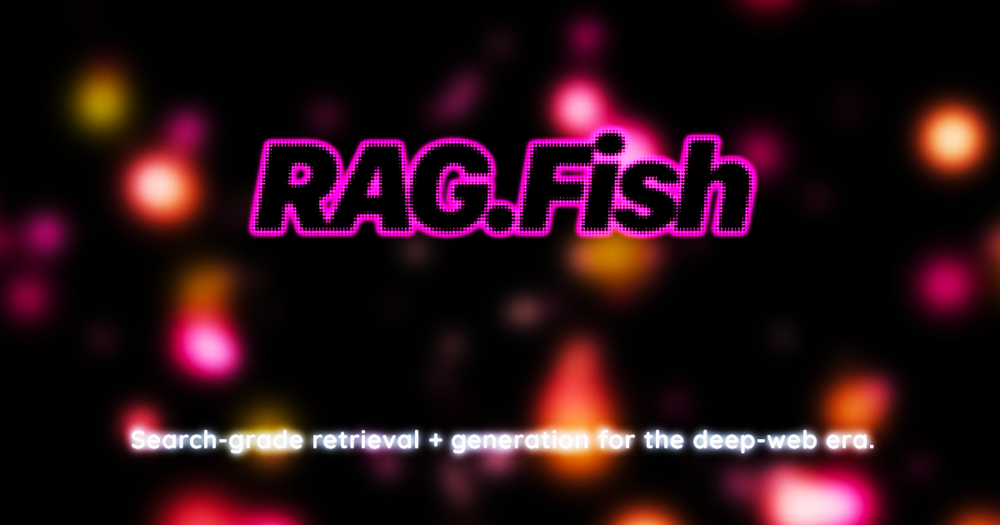

# RAGfish

- 🎮 Discord: [https://discord.gg/pcPuWcbY](https://discord.gg/pcPuWcbY)

## 🎥 Demo Video

- 📺 YouTube: [https://www.youtube.com/@VibrantEinstein](https://www.youtube.com/@VibrantEinstein)

A deep private RAG core for macOS/iOS, inspired by the depths of the ocean and now empowered with multi-modal intelligence.

## Features
- 🛡️ Privacy-first, fully on-device RAG with extended support for visual data (images, diagrams, charts)
- 💻 Runs natively on Apple Silicon (macOS/iOS, M1+) with full feature parity across platforms
- 🐟 Pre-packaged with embedded models and sample "RAGfish DB" for instant exploration
- 🗂️ Supports user-imported RAGpacks (chunked & embedded docs, ZIP format)
- Multi-RAGpack support
- Threaded Q&A history
- Full Apple Silicon optimization
- ⚡️ Fast local search, summary, and QA—no cloud, no tracking
- 🖼️ Multi-modal capabilities: image recognition, diagram/chart interpretation, and visual search
- 🚀 New model support: Jan-v1-4B/4V with GGUF model option for enhanced performance and flexibility
- Future plans: web & cloudless multi-user collaboration

## Quick Start
1. Download and launch [NoesisNoema app](https://github.com/raskolnikoff/NoesisNoema) for macOS/iOS
2. (Optional) Preprocess your own docs and images using the [RAGpack Colab Preprocessor Notebook](https://github.com/raskolnikoff/noesisnoema-pipeline/blob/main/notebooks/chunk_embed_generator.ipynb) from the noesisnoema-pipeline project, download the RAGpack ZIP, and import it in-app
3. Start asking multi-modal questions in natural language or with images. Enjoy!

*Note: Official release builds are coming soon. For now, use the main branch of NoesisNoema app. See [RAGfish](https://github.com/raskolnikoff/RAGfish) for specs and dev tools.*

## Ecosystem & Related Projects

RAGfish is the core RAGpack specification and toolkit.  
It is designed to be used with the following companion projects:

### NoesisNoema (macOS/iOS App)
- **Reference implementation:** A private RAG client for macOS and iOS that leverages RAGfish RAGpack format with full feature parity.
- **Features:**  
  - Full offline, on-device retrieval-augmented generation (RAG) with multi-modal query support (text + image)
  - QA history & thread management (your questions are stored and retrievable)
  - Multi-RAGpack support (import as many knowledge packs as you want)
  - Modern two-pane UI (QA history/threads, detail view, future extensibility)
  - Privacy-first, Apple Silicon optimized, now including visual data privacy
- **Get started:**  
  1. Download [NoesisNoema](https://github.com/raskolnikoff/NoesisNoema)
  2. Import RAGpacks (sample or your own)
  3. Ask questions, explore knowledge, upload images, and see instant answers with cited chunks and visual insights

### noesisnoema-pipeline (Colab/CLI Preprocessing Toolkit)
- **Reference pipeline:** Create your own RAGpack (.zip) from PDF/text/images using Google Colab or CLI.
- **Features:**  
  - Chunking & embedding for any document (English or multilingual) and images (including diagrams and charts)
  - Outputs compatible RAGpack (.zip) for direct import in RAGfish/NoesisNoema
  - Supports export of both `.npy` and `.csv` for easy integration (see docs)
  - Fast prototyping: no local environment required if using Colab
- **Get started:**  
  1. Go to [noesisnoema-pipeline](https://github.com/raskolnikoff/noesisnoema-pipeline)
  2. Follow the notebook or CLI steps to generate your own multi-modal RAGpack from PDF, text, or images
  3. Download and import the RAGpack (.zip) in NoesisNoema or RAGfish

## Architecture Overview

RAGfish consists of three main parts:
- The pipeline (for preprocessing and generating multi-modal RAGpacks)
- The RAGfish core engine (which performs fast local retrieval and QA across text and visual data)
- User-facing apps (NoesisNoema for macOS/iOS)

All knowledge flows through the RAGpack format for seamless integration and privacy. The architecture now embraces a multi-modal flow, combining text embeddings with visual embeddings extracted from images, diagrams, and charts. This enables rich, context-aware retrieval-augmented generation that understands and reasons over both textual and visual information—all fully on-device and privacy-preserving.

See the detailed architecture documentation and diagrams:
- [Architecture Doc](./docs/architect/ARCHITECTURE.md)
- [Component Diagram](docs/assets/ComponentDiagram.png)
- [Class Diagram](docs/assets/ClassDiagram.png)

## Business Workflow Transformation: As-Is vs. To-Be

See how RAGfish revolutionizes document Q&A and knowledge workflows compared to conventional approaches:

**Key Benefits:**
- Unified, instant document and visual data Q&A (no more fragmented search)
- On-device privacy—no cloud, no leaks, now including images and diagrams
- Fully offline, always available
- Easy to extend with your own knowledge packs (RAGpacks)
- Built for business productivity and compliance

## Project Philosophy

RAGfish is built on the principle that knowledge work should remain private, powerful, and beautiful—like the silent depths of the ocean. We believe LLM-powered RAG should require no server, no login, and no risk. Your documents, images, and brain—on your device.

## Diagrams

### Class Diagram

### Sequence Diagram

### Component Diagram

### Use Case Diagram

## Documentation
- [Architecture](./docs/architect/ARCHITECTURE.md)
- [Design Docs](./docs/designs/DesignDoc.md)
- [ADRs](./docs/adr/)

## Roadmap / Future Plans

- iOS universal app with full macOS/iOS feature parity
- Advanced chunk highlighting, source trace, and cross-document QA
- In-app RAGpack generation (pipeline-less)
- UI/UX: Enhanced right-pane for document preview, chunk roots, annotation, and visual data display
- Cloudless peer-to-peer knowledge sharing (private multi-device sync)
- More LLM model support (future Apple ML, third-party LLMs)
- API for plugin and automation extension
- In-app image-to-text analysis, diagram reasoning, and chart Q&A for seamless multi-modal interaction
- More: See [Issues](https://github.com/raskolnikoff/ragfish/issues)

## License
[MIT](./LICENSE)