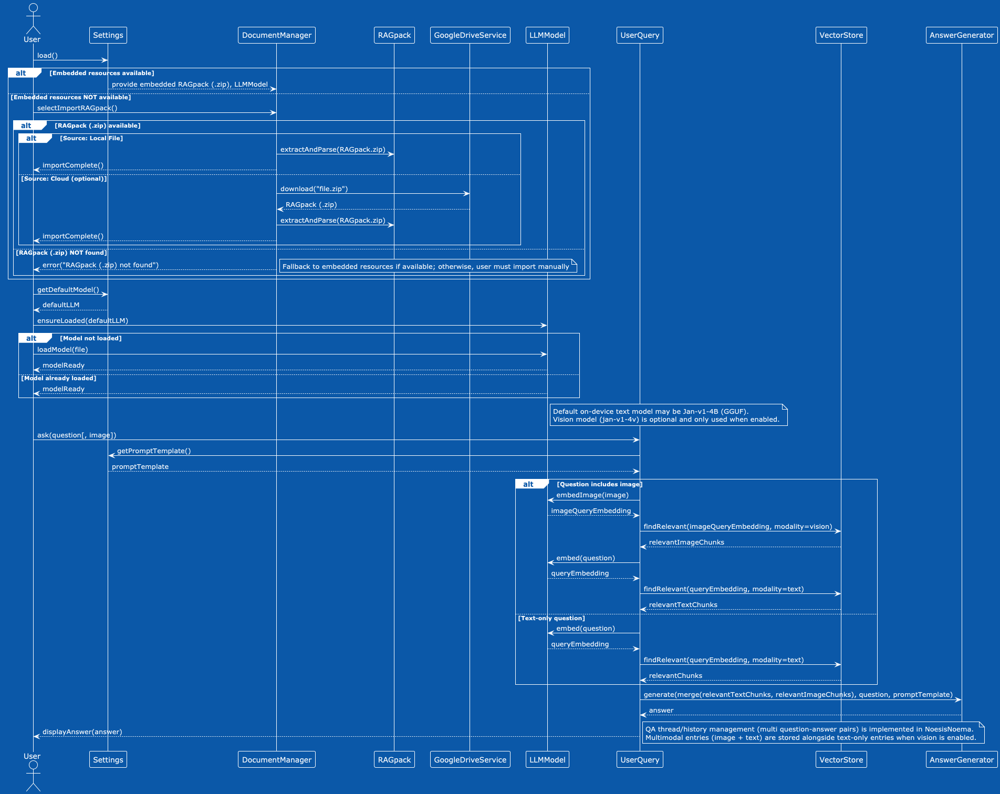

# RAGfish

A deep private RAG core for macOS/iOS, inspired by the depths of the ocean.

## Features
- 🛡️ Privacy-first, fully on-device RAG
- 💻 Runs natively on Apple Silicon (macOS/iOS, M1+)
- 🐟 Pre-packaged with embedded models and sample "RAGfish DB" for instant exploration
- 🗂️ Supports user-imported RAGpacks (chunked & embedded docs, ZIP format)
- ⚡️ Fast local search, summary, and QA—no cloud, no tracking

## Quick Start
1. Download the latest release (see [Releases](https://github.com/raskolnikoff/ragfish/releases))
2. Launch RAGfish—explore sample documents out of the box
3. (Optional) Preprocess your own docs using the [RAGpack Colab Preprocessor Notebook](https://github.com/raskolnikoff/noesisnoema-pipeline/blob/main/notebooks/chunks_and_embeddings_colab.ipynb) from the noesisnoema-pipeline project, download the RAGpack ZIP, and import it in-app
4. Start asking questions in natural language. Enjoy!

## Project Philosophy

RAGfish is built on the principle that knowledge work should remain private, powerful, and beautiful—like the silent depths of the ocean. We believe LLM-powered RAG should require no server, no login, and no risk. Your documents, your brain—on your device.

## Diagrams

### Class Diagram

### Sequence Diagram

### Use Case Diagram

## Documentation
- [Architecture](./docs/architect/ARCHITECTURE.md)
- [Design Docs (WIP)](./docs/designs/)
- [ADRs (WIP)](./docs/adr/)

## License
[MIT](./LICENSE)